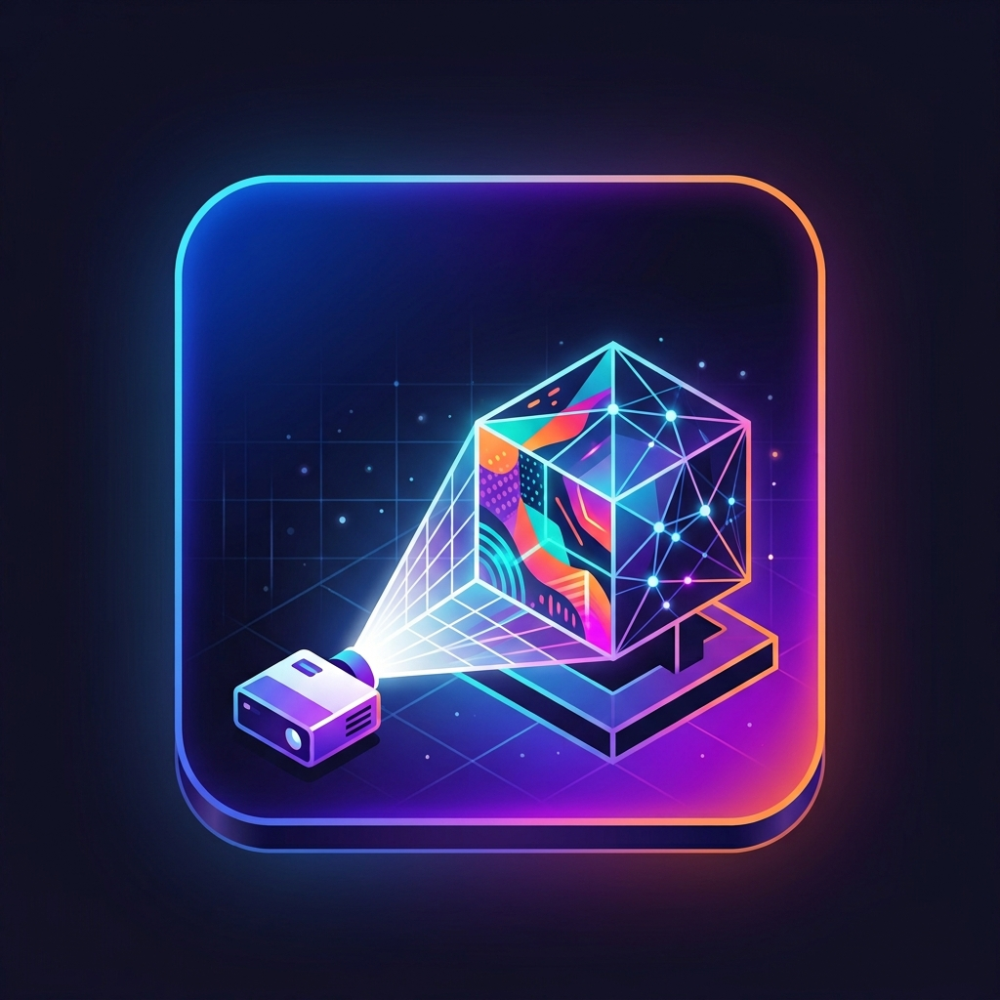

# EasyMap Studio



**Live preview**: https://easymap-studio-nine.vercel.app

**Projection mapping e VJ live nel browser.** Carichi la foto di una statua, un palco o una superficie qualsiasi, allinei la proiezione trascinando quattro angoli, applichi uno shader che si ritaglia da solo dentro i bordi del soggetto, e proietti da una finestra dedicata sincronizzata in tempo reale.

Niente installazione, niente licenze: si apre e si usa. L'obiettivo è rendere il projection mapping accessibile anche a chi non ha mai aperto un software di mapping, senza rinunciare a ciò che serve davvero su un palco.

> Progetto solista di Edoardo Tunzi, nato come esperimento di sviluppo assistito da AI mantenendo il pieno controllo su architettura, UX e implementazione. In sviluppo attivo.

---

## Novità di questa versione

- **16 shader nuovi**, per un totale di 123 effetti in libreria.
- **Filtro-leggenda O/S**: ogni effetto è marcato in blu (**O**, si modella sull'oggetto) o arancione (**S**, riempie la sagoma ignorandone il contenuto). La lettera compare accanto a ogni nome, e i due pulsanti filtrano famiglie ed elenco.
- **Esportazione in `.easymap.json` con gli asset dentro**: un progetto si riapre su un altro computer.
- **Importazione con riconoscimento automatico** del tipo di file: aggiunge senza mai sostituire il lavoro in corso.
- **Libreria preset esportabile**, tutta insieme o un preset alla volta.

---

## Come si usa

1. **Carichi** una foto del soggetto su cui proietterai (PNG scontornato, oppure con sfondo nero: viene rilevato da solo).
2. **Allinei** i quattro angoli alla superficie reale, direttamente dall'editor.
3. **Scegli un effetto** fra 123, regolabile con slider generati automaticamente dallo shader.
4. **Componi più layer** se serve — ognuno col suo media, effetto, maschera e blend mode.
5. **Apri la finestra Output** sul proiettore e vai in scena.

Il progetto si salva da solo in locale e funziona offline: a bordo palco la rete non serve.

---

## Cosa sa fare

### Effetti

- **123 shader GLSL** divisi in 12 famiglie (Rilievo, Contorni, Fluidi, Aloni, Morphogen, Frattali, Strobo, Tunnel, Plasma, Audio, Altri), con ricerca e filtri.
- Ogni effetto è marcato **O** o **S**: i 69 marcati O leggono l'immagine e ci si modellano sopra — seguono rilievi e bordi del soggetto — i 54 marcati S riempiono la sagoma con un pattern proprio. È la differenza che conta scegliendo un effetto, e non si legge dal nome.
- **Controlli globali validi su qualsiasi shader**: velocità, rotazione, pan, kaleidoscopio, mirror, pixelate, luminosità, contrasto, saturazione, posterize, negativo.
- **Palette colori** con preset fluorescenti, editor a 5 colori e generatore casuale con schemi di armonia. Il **Loop** le rigenera da sole a intervallo regolabile, con dissolvenza.
- **Random dei controlli**: un pulsante estrae valori casuali dentro i range dello shader, per far emergere look che a mano non proveresti.

### Layer e maschere

- Scena come **pila di layer indipendenti**: aggiungi, duplichi, riordini, nascondi, con opacità e **13 blend mode**.
- Ogni layer ha il suo media: **immagine, GIF, video o ripresa live** da webcam e capture card HDMI.
- **Maschere** rettangolo/ellisse con sfumatura, rotazione e inversione, oppure da PNG stencil — editabili sul canvas.
- **Corner-pin** a quattro maniglie per layer, con zoom e pan dell'anteprima indipendenti dalla proiezione.

### Playlist

- Timeline di clip con **durata trascinabile**, miniatura per ogni effetto ed editor rapido.
- Transizioni **crossfade** o taglio secco, play/pausa e loop.
- Playlist anche di **contenuti**: una cartella su disco i cui media si alternano nel layer a intervallo regolare.

### Output e live

- Finestra **Output** dedicata, sincronizzata in tempo reale, che si apre da sola sul secondo schermo dove il browser lo consente.
- Modalità **Live**: le modifiche restano in prova nell'editor finché non le mandi in onda con un tasto — così puoi sperimentare senza disturbare la proiezione.
- **Qualità di resa** tarabile sul proiettore che hai davanti: supersampling, dithering contro il banding dei gradienti, grana, sfondamento morbido delle alte luci.
- Sulla finestra di proiezione, `S` apre la **diagnostica** (pixel reali, fps, avviso se la finestra non copre lo schermo) e `C` un **cartello di prova** che in dieci secondi dice se il limite è l'app, il proiettore o il sistema.

### Progetti e preset

- **Salvataggio con nome** e **autosave** che ripristina l'ultima sessione.
- **Esporta e importa su file**, asset inclusi: un progetto si porta su un'altra macchina o si manda a qualcuno. L'import aggiunge alla lista senza sostituire ciò su cui stai lavorando.
- **Preset di effetto**: salvi il look di un layer (shader, parametri, size, palette) e lo riapplichi ovunque. La libreria si esporta a parte, perché vale su tutti i progetti e non dentro uno solo.
- Il pannello mostra lo **spazio occupato** nel browser, diviso fra progetti salvati e scena in corso.

### Scorciatoie

Le operazioni che si ripetono durante una performance non passano dal mouse.

| Tasto               | Azione                                                                        |
| ------------------- | ----------------------------------------------------------------------------- |
| `⌥A` / `⌥S`         | Effetto precedente / successivo                                               |
| `Spazio`            | Manda all'Output le modifiche in sospeso (in modalità Live)                   |
| `↑ ↓ ← →`           | Sposta l'angolo selezionato o l'intera proiezione (`Shift` = ×5)              |
| `Spazio` + trascina | Pan dell'anteprima (o tasto centrale)                                         |
| Rotellina           | Zoom dell'anteprima                                                           |
| `⌘B` / `Ctrl+B`     | Mostra/nasconde il pannello laterale                                          |
| `F` · `S` · `C`     | Sulla finestra di proiezione: pieno schermo · diagnostica · cartello di prova |

---

## Stack

| Ambito        | Tecnologie                                                       |
| ------------- | ---------------------------------------------------------------- |
| Framework     | React 19, TypeScript, Vite 8                                     |
| Rendering     | Three.js, React Three Fiber, GLSL (parser ISF-like proprietario) |
| Stato         | Zustand                                                          |
| Persistenza   | IndexedDB (`idb`), autosave, export/import su file JSON          |
| UI            | Tailwind CSS v4, shadcn/ui (Radix), lucide-react                 |
| Sync finestre | `BroadcastChannel`                                               |
| Media         | `VideoTexture`, `gifuct-js`, `getUserMedia`                      |
| Offline       | `vite-plugin-pwa`                                                |

---

## Avvio

```bash
npm install
npm run dev
```

```bash
npm run build
```

Apri `/control` per l'editor e `/output` sul secondo monitor per la proiezione.

---

## Roadmap

- ✅ **MVP**: upload, corner-pin, libreria shader, palette, preset, persistenza.
- ✅ **Multi-layer**: layer indipendenti, maschere, video e GIF, modalità Live, playlist.
- ✅ **Live**: ingresso video da webcam e capture card, pipeline di output ad alta qualità, export dei progetti su file.
- ⏳ **In arrivo**: audio-reactive con FFT, sync BPM, controller MIDI, bridge OSC/DMX, multi-output.
- 🔭 **Oltre**: motore particellare GPU e feedback buffer per le scie accumulate.

Dettaglio in `TODO.md`.

---

## Autore

Sviluppato da **Edoardo Tunzi**.

> ⭐ Se EasyMap Studio ti è utile, lascia una Star su GitHub.
>
> 🚀 Per contribuire o collaborare, scrivimi: sarò felice di confrontarmi.
